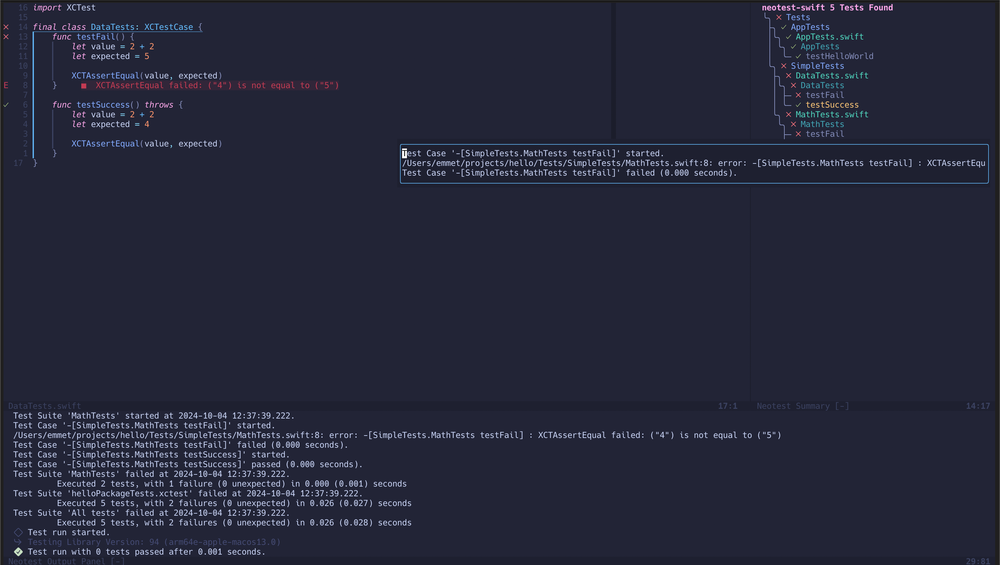

## neotest-swift

This is a basic [neotest](https://github.com/nvim-neotest/neotest) adapter that allows running tests using the `swift test` command.



### Features

- [x] Running a single test case, all the tests in a file, all the tests in a target or all the tests in a project
- [x] Test watching
- [x] Virtual text showing test failure messages
- [x] Displaying full and short test output
- DAP support


### Installation

[packer.nvim](https://github.com/wbthomason/packer.nvim)

```lua
use {
  "nvim-neotest/neotest",
  requires = {
    "nvim-neotest/nvim-nio",
    "nvim-lua/plenary.nvim",
    "antoinemadec/FixCursorHold.nvim",
    "nvim-treesitter/nvim-treesitter",
    "ehmurray8/neotest-swift"
  }
}
```


### Configuration

#### Neotest

Provide your adapters and other config to the setup function.

```lua
require("neotest").setup({
	adapters = {
		require("neotest-swift")({ }),
	},
    output = {
        enabled = true,
        open_on_run = false
    }
})
```

#### nvim-dap

Requires:
* [nvim-dap](https://github.com/mfussenegger/nvim-dap)
* [codelldb](https://github.com/vadimcn/codelldb)
  * I installed it with [Mason](https://github.com/williamboman/mason.nvim)
* (Optional) [nvim-dap-ui](https://github.com/rcarriga/nvim-dap-ui)


```lua
local dap = require("dap")

dap.adapters.swift = {
	type = "server",
	port = "${port}",
	executable = {
		command = "/Users/emmet/.local/share/nvim/mason/bin/codelldb", -- Modify with your absolute path
		args = { "--port", "${port}" },
	},
}

dap.configurations.swift = {
  {
    name = "Launch file",
    type = "swift",
    request = "launch",
    program = function()
      return vim.fn.input('Path to executable: ', vim.fn.getcwd() .. '/', 'file')
    end,
    cwd = '${workspaceFolder}',
    stopOnEntry = false,
  },
}

-- Optional config for code symbol breakpoints in the sign column
vim.fn.sign_define("DapBreakpoint", { text = "󰙦 ", texthl = "DapBreakpoint", linehl = "", numhl = "DapBreakpoint" })
vim.fn.sign_define("DapBreakpointCondition", { text = "󰙧 ", texthl = "DapBreakpointConditional", linehl = "", numhl = "DapBreakpointConditional" })
vim.fn.sign_define("DapBreakpointRejected", { text = " ", texthl = "DapBreakpointRejected", linehl = "", numhl = "DapBreakpointRejected" })
vim.fn.sign_define("DapStopped", { text = "", texthl = "DapStopped", linehl = "DapStoppedLine", numhl = "DapStopped" })
vim.fn.sign_define("DapLogPoint", { text = "", texthl = "DapLogPoint", linehl = "DapLogPoint", numhl = "DapLogPoint" })
```


### Helpful Keybindings

```lua
-- Neotest
vim.keymap.set("n", "<Leader>tr", function() require("neotest").run.run() end, { desc = 'Run nearest test' })
vim.keymap.set("n", "<Leader>td", function() require("neotest").run.run({ strategy = "dap" }) end, { desc = 'Debug nearest test' })
vim.keymap.set("n", "<Leader>tf", function() require("neotest").run.run(vim.fn.expand("%")) end, { desc = 'Run all tests in file' })
vim.keymap.set("n", "<Leader>ta", function() require("neotest").run.run({ suite = true }) end, { desc = 'Run all tests in project' })
vim.keymap.set("n", "<Leader>tt", function() require("neotest").run.run({ suite = true, extra_args = { target = true } }) end, { desc = 'Run all tests in target (swift).' })
vim.keymap.set("n", "<Leader>tw", function() require("neotest").watch.toggle() end, { silent = true, desc = 'Watch test' })
vim.keymap.set("n", "<Leader>ts", function() require("neotest").summary.toggle() end, { silent = true, desc = 'Test summary' })
vim.keymap.set("n", "<Leader>to", function() require("neotest").output.open({ short = true, enter = true }) end, { silent = true, desc = 'Open test output' })
vim.keymap.set("n", "<Leader>tp", function() require("neotest").output_panel.toggle() end, { silent = true, desc = 'Toggle test output pane' })

-- nvim-dap
vim.keymap.set("n", "<Leader>db", function() require("dap").toggle_breakpoint() end, { desc = "Debug set breakpoint" })
vim.keymap.set("n", "<leader>de", function() require("dapui").eval() end, { desc = "Debug evaluate" })
vim.keymap.set("n", "<Leader>dc", function() require("dap").continue() end, { desc = "Debug continue" })
vim.keymap.set("n", "<Leader>do", function() require("dap").continue() end, { desc = "Debug step over" })
vim.keymap.set("n", "<Leader>di", function() require("dap").continue() end, { desc = "Debug step into" })
vim.keymap.set("n", "<Leader>dr", function() require("dap").repl.open() end, { desc = "Debug run repl" })

vim.api.nvim_create_user_command("DAPUI", function() require("dapui").toggle() end, { desc = "Open DAPUI" })
```

